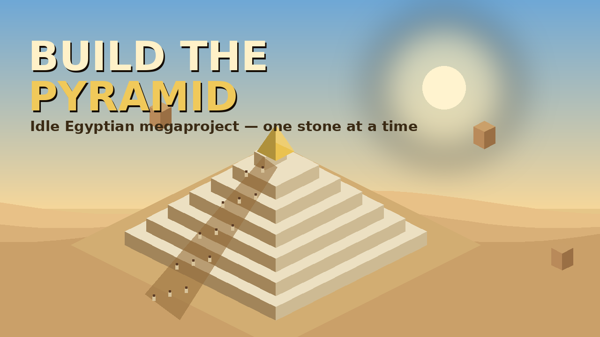

# 🔺 Build the Pyramid

An **idle tycoon / incremental clicker** set in Ancient Egypt. You are the
Pharaoh, and your pyramid is **never a progress bar** — it is physically built,
**brick by brick**, in a warm low-poly isometric desert, until a golden-capstoned
monument towers over the dunes. Then you found a new dynasty and build a greater
one.

Play in any modern browser — desktop, mobile (touch), or with a gamepad.



## Play

- **Tap the pyramid** to lay stone by hand (the click phase).
- Build **quarries, farms and wells** for the six resources, and hire **crews**
  to haul and set blocks automatically (the idle phase).
- Construction runs at the **slowest of Supply, Transport and Placement** — the
  panel shows the bottleneck, and fixing it speeds everything up.
- Crews **eat food and drink water**; starve them and morale collapses into a
  **strike**.
- Weather (sandstorms, extreme heat, the **Nile flood**, rare rain) and
  disasters (ramp collapse, tomb robbers, the Pharaoh's passing, plague)
  interrupt the work — **priests, temples and overseers** keep them at bay.
- Finish every layer to raise the **golden capstone**, then **found a New
  Dynasty** to keep your Legacy and build the next, greater wonder.

### The wonders (prestige ladder)
Step → Bent → Great → Golden → Black Obsidian → Floating Divine → and on,
forever, each bigger than the last (millions, then billions of blocks).

### Controls
- **Tap / click** the pyramid — lay stone. **Drag** to pan, **scroll / pinch** to zoom.
- **Space / Enter** — lay stone. **M** — mute. **+ / −** — zoom. **Esc** — close dialogs.
- **Gamepad** — A button lays stone.

Progress **auto-saves** to your browser and keeps building **while you're away**
(offline progress, capped at 12 h).

## Run locally

ES modules need a server (not `file://`):

```bash
cd game
python3 -m http.server 8099
# open http://localhost:8099/   (append ?dev=1 for the FPS/entity overlay)
```

## Project structure

```
game/                 # the deployable game (this folder is the zip root)
  index.html          # canvas + UI overlay
  logic.js            # solo rules stub required by the platform
  strings.js          # all UI chrome text (localization-ready)
  styles.css          # responsive UI styling
  assets/             # thumbnail.png, favicon.png
  src/
    main.js           # bootstrap, fixed-timestep loop, input wiring
    data.js           # ALL balance numbers & content (resources, crew, machines,
                      #   city, blessings, wonders, weather, disasters)
    state.js          # game state model + cost/cap helpers
    sim.js            # simulation tick, the build chain, actions, prestige
    render.js         # isometric Canvas2D renderer (cached layers + live scene)
    iso.js            # isometric projection & pyramid geometry
    audio.js          # procedural Web Audio SFX + generative ambient music
    ui.js             # DOM HUD / build menus / modals
    icons.js          # SVG icon set
    rng.js, format.js # seeded RNG, number/time formatting
design/               # plan.md, thresholds.md, assets.csv (design docs)
tools/                # make_card_art.py (deploy art), test_sim.mjs, smoke.mjs
```

## Tech notes

- **Pure vanilla** — no frameworks or runtime dependencies; renders on one
  `<canvas>` with a DOM HUD overlaid.
- **Performance:** completed pyramid layers are cached to an offscreen canvas
  (one blit/frame); only the active layer, capstone, workers, weather and tint
  redraw. Worker sprites and particles are pooled and capped. DPR capped at 1.5.
  Fixed-timestep simulation with a seeded RNG; logic is separate from rendering.
- **Responsive & accessible:** touch / mouse / keyboard (physical key codes) /
  gamepad are all first-class; the layout reflows for phones.
- **Art & audio:** the workspace was out of image/audio credits, so **all art is
  hand-crafted procedural Canvas2D** in one committed style and **all sound is
  synthesized at runtime** with the Web Audio API. The deploy thumbnail/favicon
  are rendered with `tools/make_card_art.py` (Pillow). Add credits later and the
  AI assets can be generated and the game redeployed in place.

## Testing

```bash
node tools/test_sim.mjs          # headless core-simulation tests
# browser smoke test (needs a Chromium for Playwright):
cd game && python3 -m http.server 8099 &
PW_PATH="$(npm root -g)/playwright" node ../tools/smoke.mjs
```
